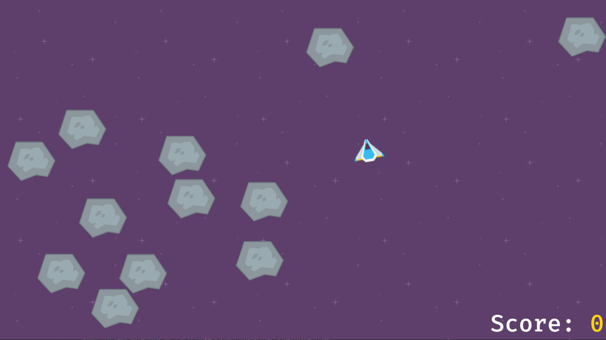

# Asteroids Clone
For learning Bevy.

### Sources
* Starting from https://bevyengine.org/examples/2D%20Rendering/rotation/.
* Book https://bevy-cheatbook.github.io/introduction.html
* Assets from https://raphaeljaes.itch.io/asteroids-mini-template
* Shameless copy of https://www.youtube.com/watch?v=QCys49c44PU
* Borrowed stuff from https://github.com/rsaihe/zenith/tree/main
* UI stuff learned from https://www.rustadventure.dev/2048-with-bevy-ecs/bevy-0.6/writing-a-plugin-to-handle-game-ui-using-bevys-built-in-ui-abstractions
